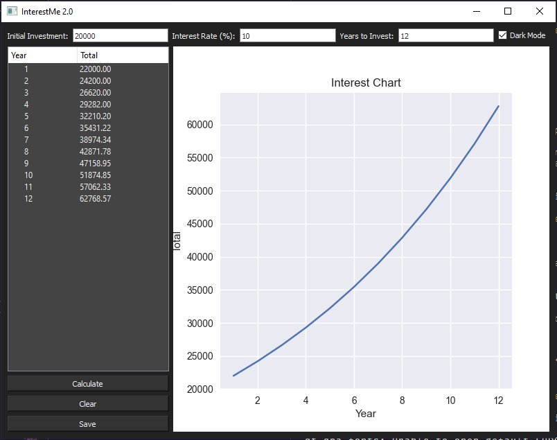

# Simple Interest Rate Calculator App
## Made with PyQt5 and Matplotlib

### Overview
This Interest Rate Calculator is a desktop application developed using PyQt for the user interface and Matplotlib for plotting graphs. The application allows users to calculate the future value of an investment or loan based on various input parameters such as principal amount, interest rate, and time period. Additionally, it provides a visual representation of how the investment or loan grows over time through a dynamic graph.

### Features
* **User-Friendly Interface:** Built with PyQt to ensure an intuitive and easy-to-navigate interface.
* **Flexible Input Parameters:**
  * Principal Amount: The initial amount of money invested or loaned.
  * Interest Rate: The annual interest rate (percentage).
  * Time Period: The duration for which the money is invested or borrowed.
* **Real-Time Calculations:** Instant computation of the future value based on user inputs.
* **Dynamic Graphs:** Utilizes Matplotlib to display the growth of the investment or loan over time, helping users visualize the impact of different interest rates.
* **Save and Export:** Option to save the plotted graphs as image files for further analysis or reporting.

### Requirements
* Python 3.x
* PyQt5
* Matplotlib

### Installation
1. Clone the repository:

    `git clone https://github.com/kinyuajohn/interest_calculator.git`

2. Navigate to the project directory:

    `cd interest-rate`

### Usage
1. Run the application:

   `py main.py`
2. Enter the principal amount, interest rate, and time period in the provided fields.
3. Click the "Calculate" button to see the results.
4. View the interest growth over time in the interactive plot.
5. Save the plot as an image file if needed.

### Screenshot

